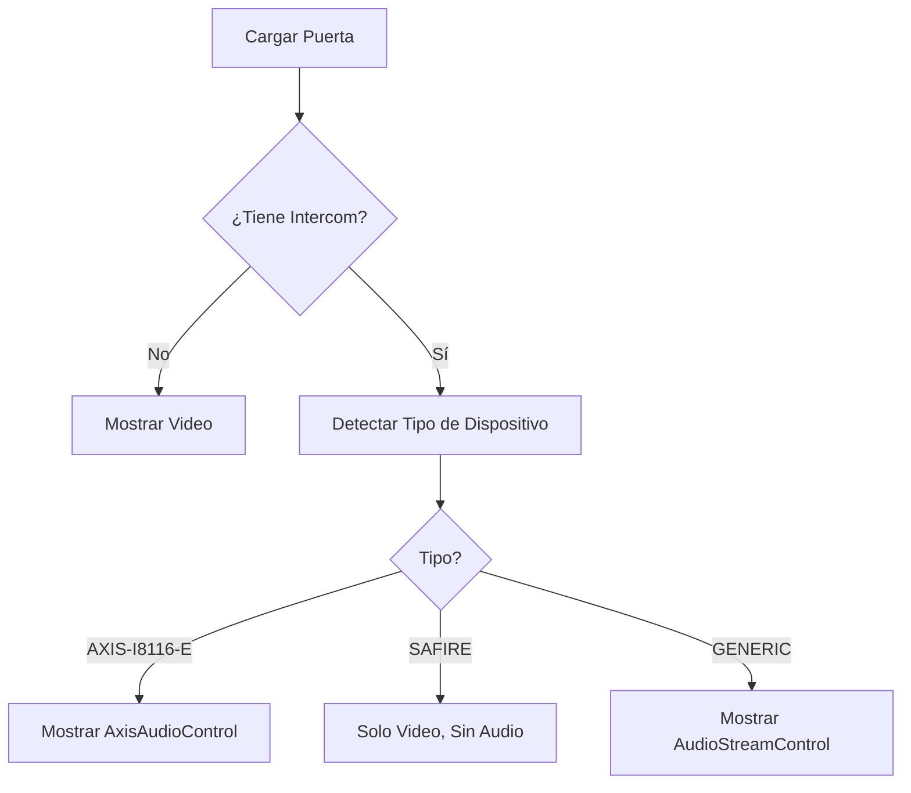

# Configuración de Dispositivos por IP

## 🎯 Resumen

Este documento describe cómo el sistema detecta automáticamente el tipo de dispositivo según su dirección IP y aplica el control de audio apropiado.

---

## 📋 Dispositivos Configurados

### 1. AXIS I8116-E (IP: 192.168.1.130)

**Tipo:** Intercomunicador de red  
**Fabricante:** AXIS Communications  
**Capacidades de Audio:** ✅ Audio bidireccional completo

#### Características:
- ✅ **Micrófono integrado** - Captura de audio de alta calidad
- ✅ **Altavoz integrado** - Reproducción de audio clara
- ✅ **Cancelación de eco** - Hardware integrado
- ✅ **Reducción de ruido** - Procesamiento avanzado
- ✅ **API VAPIX** - Control estándar y documentado
- ✅ **Protocolo SIP** - Compatible con sistemas de telefonía

#### Control de Audio:
```
[AXIS I8116-E - Audio Bidireccional]
┌────────────────────────────────────┐
│ 🟢 COMUNICACIÓN ACTIVA            │
│ ✅ AXIS I8116-E compatible         │
│                                    │
│ [INICIAR LLAMADA]  [ACTIVO]       │
│                                    │
│ Comunicación de audio en tiempo    │
│ real con cancelación de eco        │
└────────────────────────────────────┘
```

---

### 2. Safire SF-VI131-IPW-MF (IP: 192.168.1.117)

**Tipo:** Cámara IP con audio  
**Fabricante:** Safire  
**Capacidades de Audio:** ⚠️ Solo audio de un sentido (escuchar)

#### Características:
- ✅ **Video de alta calidad** - 5 MP
- ✅ **Audio de un sentido** - Solo escuchar desde la cámara
- ❌ **NO soporta intercomunicación** - No puede hablar hacia la cámara
- ❌ **API de audio no documentada** - Endpoints CGI devuelven 403
- ⚠️ **Solo vigilancia** - Diseñada para monitoreo, no comunicación

#### Control de Audio:
```
[Safire SF-VI131-IPW-MF]
┌────────────────────────────────────┐
│ 📹 VIDEO EN VIVO                   │
│                                    │
│ (No hay control de audio)          │
│                                    │
│ ⚠️ Este dispositivo no soporta     │
│    intercomunicación bidireccional │
└────────────────────────────────────┘
```

---

## 🔧 Configuración Automática

### Archivo: `utils/deviceDetector.ts`

El sistema detecta automáticamente el tipo de dispositivo según su IP:

```typescript
const KNOWN_DEVICES: Map<string, DeviceType> = new Map([
  // AXIS I8116-E - Intercomunicador con audio bidireccional
  ['192.168.1.130', 'AXIS-I8116-E'],
  
  // Safire SF-VI131-IPW-MF - Cámara con audio de un sentido
  ['192.168.1.117', 'SAFIRE'],
]);
```

### Añadir Nuevos Dispositivos

Para añadir un nuevo dispositivo, edita `utils/deviceDetector.ts`:

```typescript
// Añadir al mapa KNOWN_DEVICES
['192.168.1.XXX', 'AXIS-I8116-E'],  // Para otro AXIS
['192.168.1.YYY', 'SAFIRE'],        // Para otra Safire
['192.168.1.ZZZ', 'GENERIC'],       // Para dispositivo genérico
```

---

## 🎨 Interfaz de Usuario

### Puerta con AXIS I8116-E (192.168.1.130)

```
┌─────────────────────────────────────────────┐
│ PUERTA PRINCIPAL                             │
├─────────────────────────────────────────────┤
│                                              │
│  📹 [Video en vivo]                          │
│                                              │
├─────────────────────────────────────────────┤
│ [AXIS I8116-E - Audio Bidireccional] VAPIX  │
│ 🟢 COMUNICACIÓN ACTIVA                       │
│ ✅ AXIS I8116-E compatible                   │
│                                              │
│ [INICIAR LLAMADA]  [ACTIVO]                 │
│                                              │
│ Comunicación de audio en tiempo real con    │
│ cancelación de eco y reducción de ruido     │
├─────────────────────────────────────────────┤
│ [LLAMAR]        [ABRIR PUERTA]              │
└─────────────────────────────────────────────┘
```

### Puerta con Safire (192.168.1.117)

```
┌─────────────────────────────────────────────┐
│ PUERTA SECUNDARIA                            │
├─────────────────────────────────────────────┤
│                                              │
│  📹 [Video en vivo]                          │
│                                              │
├─────────────────────────────────────────────┤
│ (Sin control de audio - solo visualización) │
├─────────────────────────────────────────────┤
│ [LLAMAR]        [ABRIR PUERTA]              │
└─────────────────────────────────────────────┘
```

---

## 📊 Matriz de Compatibilidad

| Dispositivo | IP | Audio | Intercomunicador | API | Control Mostrado |
|-------------|-----|-------|-----------------|-----|------------------|
| AXIS I8116-E | 192.168.1.130 | ✅ Bidireccional | ✅ Sí | VAPIX | `AxisAudioControl` |
| Safire SF-VI131 | 192.168.1.117 | ⚠️ Un sentido | ❌ No | Ninguna | Ninguno |
| Genérico | Otra IP | ❓ Desconocido | ❓ Desconocido | Estándar | `AudioStreamControl` |

---

## 🔍 Detección en Tiempo de Ejecución

### Logs de Consola

Cuando se carga una puerta, verás en la consola:

```
🔍 Puerta Puerta Principal: IP=192.168.1.130, Tipo=AXIS-I8116-E, Intercom=true
✅ Dispositivo detectado: 192.168.1.130 -> AXIS-I8116-E

🔍 Puerta Puerta Secundaria: IP=192.168.1.117, Tipo=SAFIRE, Intercom=false
✅ Dispositivo detectado: 192.168.1.117 -> SAFIRE
```

### Flujo de Detección



---

## 🚀 Uso en la Aplicación

### 1. Abrir Modo Manual

```
[App] > [MODO MANUAL]
```

### 2. Seleccionar Puerta

- **Puerta Principal (192.168.1.130)** → AXIS I8116-E
  - ✅ Control de audio completo
  - Botón "INICIAR LLAMADA"
  - Control de micrófono y volumen

- **Puerta Secundaria (192.168.1.117)** → Safire
  - 📹 Solo video
  - No hay control de audio
  - Usar botón "LLAMAR" para SIP (si está configurado)

---

## 🛠️ Mantenimiento

### Añadir Nueva IP

1. Identificar el tipo de dispositivo
2. Editar `utils/deviceDetector.ts`
3. Añadir al mapa `KNOWN_DEVICES`:
   ```typescript
   ['192.168.1.NEW_IP', 'TIPO_DE_DISPOSITIVO'],
   ```
4. Reiniciar la aplicación

### Cambiar IP de Dispositivo Existente

1. Editar `utils/deviceDetector.ts`
2. Cambiar la IP en el mapa:
   ```typescript
   // Antes
   ['192.168.1.130', 'AXIS-I8116-E'],
   
   // Después
   ['192.168.1.150', 'AXIS-I8116-E'],
   ```
3. Actualizar configuración en la app
4. Reiniciar la aplicación

---

## 📚 Referencias

- [AXIS Audio Setup](./AXIS_AUDIO_SETUP.md) - Configuración detallada de AXIS I8116-E
- [Safire Audio Setup](./SAFIRE_AUDIO_SETUP.md) - Limitaciones de Safire
- [Device Detector Utils](../utils/deviceDetector.ts) - Código fuente

---

## ✅ Checklist de Configuración

- [x] AXIS I8116-E configurado en 192.168.1.130
- [x] Safire SF-VI131-IPW-MF configurado en 192.168.1.117
- [x] Detección automática implementada
- [x] Control de audio AXIS integrado
- [x] Control de audio Safire deshabilitado
- [ ] Probar comunicación con AXIS
- [ ] Probar video con Safire
- [ ] Verificar logs de detección

---

**Última actualización:** 18 de Octubre, 2025  
**Versión:** 1.0.0

